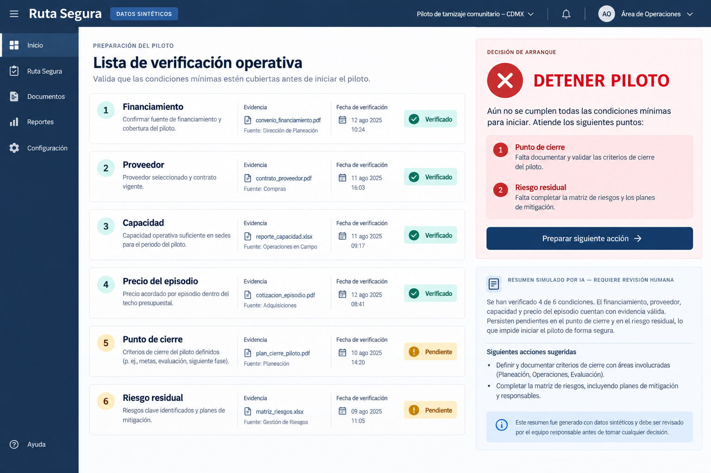
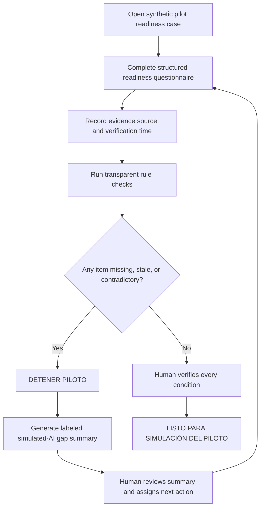
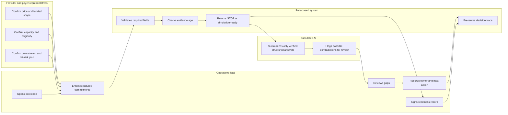

# Ruta Segura - Week 5 build packet

Status: draft for review before code

## Problem in my words

Early-detection programs can identify a serious health concern faster than the care system can absorb it. In Mexico, a screening result may leave an uninsured or underinsured person carrying fear, transport costs, lost wages, tests, treatment expenses, and follow-up uncertainty while the screener keeps the commercial benefit. The first product problem is therefore not another detection interface: it is a gate that stops a pilot before screening begins unless a named payer, provider, navigator, complete price, verified capacity, care endpoint, and plan for downstream and tail risk are real and current.

## Exact user

Mariana, an operations lead preparing a small screening pilot inside one Mexican public primary-care network. She is accountable for showing that the pilot has a purchaser, funded human navigator, eligible receiving provider, reserved capacity, agreed price, defined care endpoint, and financed response to downstream and tail risk. She needs a defensible start-or-stop record before any patient is enrolled.

All people, organizations, records, quotations, and capacities shown in this course build are invented and labeled as synthetic.

## Success definition

Before the module closes, Mariana can complete a synthetic readiness questionnaire, attach or select evidence metadata for every required condition, and receive an auditable **DETENER PILOTO** decision whenever funding, provider, price, verified capacity, endpoint, downstream plan, or tail-risk coverage is missing or stale. When every required condition is current and human-verified, the interface may show **LISTO PARA SIMULACIÓN DEL PILOTO**; it never authorizes live screening, diagnoses a patient, or promises treatment.

## Image-generated mockup

The mockup was generated specifically for this packet. It is a direction for hierarchy and clarity, not proof of a completed interface. The working build may simplify navigation and copy after mechanical and persona testing.

## Feature flow

## Actor swimlane

## Benchmark

Best existing solution on Earth for this: our strongest relevant benchmark is [Unite Us' Closed-Loop Referral System](https://uniteus.com/products/closed-loop-referral-system/), which coordinates referrals across trusted organizations, distinguishes resolved from unresolved outcomes, and exposes what happened after a referral was sent.

Mine differs or localizes by: Ruta Segura works one step earlier for a narrow Mexican healthcare pilot, returning a stop decision before screening when the payer, verified clinical capacity, complete episode price, endpoint, downstream plan, or tail-risk coverage is absent instead of assuming a referral network is ready to receive the case.

## Long view - light charter

If this slice works, Ruta Segura becomes the pre-deployment assurance layer for health programs that combine screening, navigation, and clinical care in Mexico. In three years, it could maintain verified payer commitments, provider capacity, episode prices, escalation contracts, and outcome evidence across multiple conditions and local networks. Its durable value would come from preventing institutions from launching detection faster than they can finance and deliver the care those results create.

## Blueprint conditions translated into the slice

| Blueprint condition | How this slice honors it |
|---|---|
| No stranded result | The gate acts before screening and blocks launch when a funded route is incomplete. It never displays a patient risk result. |
| Route verified within 72 hours | Provider eligibility, availability, documents, and cost receive source and timestamp fields; stale items fail the gate. |
| Named payer, navigator, capacity, price, downstream plan, and tail risk | These are required structured questionnaire sections, not optional notes. |
| Consent and minimum data | The build uses no real patient records. A live-product consent requirement remains visible as a non-negotiable deployment condition. |
| Verified closure | The packet distinguishes this readiness gate from referral or treatment closure and makes no care-completion claim. |
| Compare manual, fixed-form, and AI support | Testing compares the transparent rule result with the simulated-AI summary; the AI is removable if it adds no useful, verifiable information. |

## Scope cut

This week I am **not** building:

- a symptom checker, diagnostic model, urgency classifier, or patient risk score;
- a live patient-facing application or patient enrollment flow;
- real provider integrations, appointment booking, payments, insurance eligibility, or medical records;
- document upload, OCR, or verification of whether an attached contract is authentic;
- a national directory of hospitals, pharmacies, or specialists;
- prediction of referral volume, disease prevalence, treatment response, or individual outcomes;
- persistent storage, authentication, or real personal data;
- proof that an attended visit equals treatment completion or cure;
- permission to begin live screening.

## Architecture and stack

| Layer | Choice | Why it is enough this week |
|---|---|---|
| Interface | React + TypeScript, single responsive route | Supports a focused, testable working surface suitable for Vercel. |
| Structured signal | Versioned readiness questionnaire with controlled fields, evidence source, and verification time | Meets the signal requirement while keeping the decision auditable. |
| Gate logic | Deterministic TypeScript rules | A safety-critical STOP decision remains explainable and testable. |
| LLM behavior | Deterministic simulated-LLM summary, labeled on the trigger and output | Demonstrates bounded assistance without secrets, cost, or false autonomy. |
| State | Browser-session state with invented seed cases | Avoids storing personal information and keeps the course slice reproducible. |
| Validation | Required fields, allowlisted states, numeric bounds, and bounded notes | Prevents raw or unbounded text from entering the workflow. |
| Testing | Unit tests plus a documented persona walkthrough | Covers rule correctness and comprehension. |
| Deployment | Vercel free tier | Provides the required live URL and two deployment checkpoints. |

## Security floor decisions

1. The build uses no API keys or secrets.
2. It stores no personal data, so authentication is not required for this synthetic course slice.
3. It uses no user-data database, so Row Level Security is not applicable.
4. Every editable field has a type, allowed values, length limit, and validation message.
5. Every displayed person, provider, payer, quotation, capacity, and AI output is invented and labeled.

## Test plan

### Mechanical pass

1. Missing payer: the result is **DETENER PILOTO** and names the payer as the blocking condition.
2. Missing navigator or caseload limit: the result is **DETENER PILOTO**.
3. Stale provider verification: any route detail older than 72 hours fails the gate.
4. Missing receiving capacity: zero reserved slots or an unverified receiver fails the gate.
5. Incomplete price: a price that omits a required episode component fails the gate.
6. Missing endpoint: an undefined diagnostic or treatment endpoint fails the gate.
7. Missing downstream or tail-risk coverage: the gate remains stopped even if the immediate next step is financed.
8. Complete synthetic case: every rule passes and the result is **LISTO PARA SIMULACIÓN DEL PILOTO**, never approval for live screening.
9. Simulated AI: every trigger and output is labeled, cites only questionnaire fields, and cannot change the rule result.
10. Contradiction test: the simulated AI flags a mismatch between a quoted capacity and the operator's entered capacity for human review.
11. Input validation: negative prices, impossible capacities, invalid dates, and overlong notes are rejected with visible messages.
12. Accessibility and responsive checks: the primary task, status, errors, and action controls remain understandable without relying on color alone.

The mechanical pass must identify at least one genuine bug, document it, fix it, and trigger the second deployment.

### Persona pass

Open a fresh conversation with this synthetic persona:

> You are Mariana, 41, operations coordinator for a public primary-care network in Mexico City. You are responsible for opening a small screening pilot, but you do not negotiate clinical contracts yourself. You work quickly, distrust vague dashboard labels, and will stop using a tool if it hides who must act next. Walk through each screenshot in order as Mariana. Narrate what you think the screen means, where you hesitate, what evidence you would need, and where you might make a dangerous assumption or quit.

Show screenshots in task order: incomplete case, evidence entry, STOP result, simulated-AI summary, assigned next action, and complete synthetic case. Log every confusion in `docs/PERSONA.md`, rank findings by harm, and fix the most serious one before the final deployment.

## Acceptance boundary

The slice succeeds when it produces an explainable readiness record and blocks an unsafe synthetic pilot configuration. It does not verify contracts, provide medical advice, enroll patients, confirm that care occurred, or authorize live deployment.
