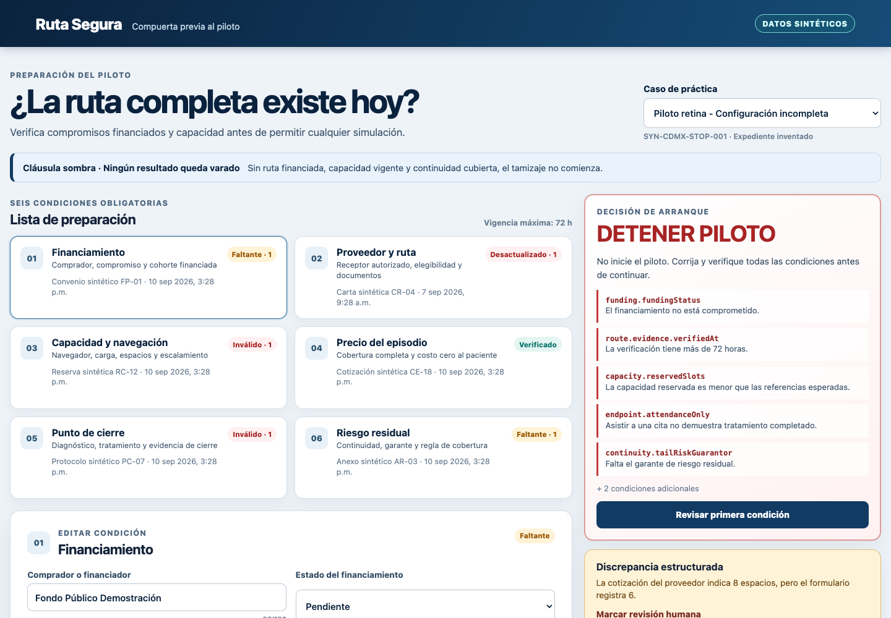
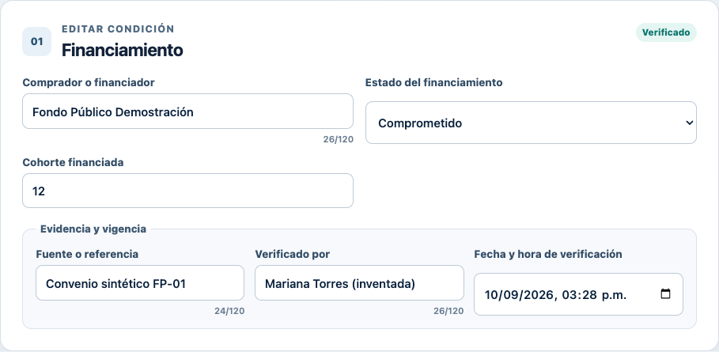
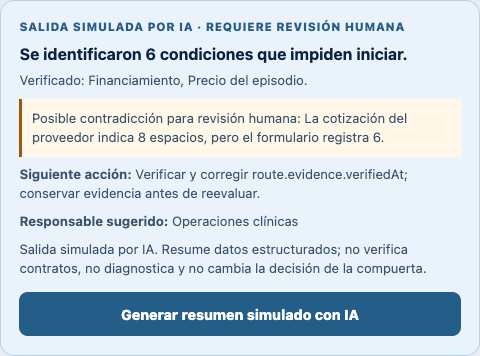
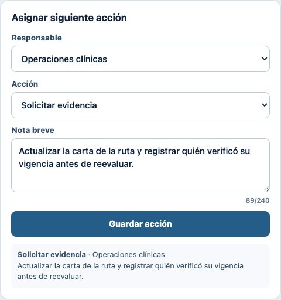
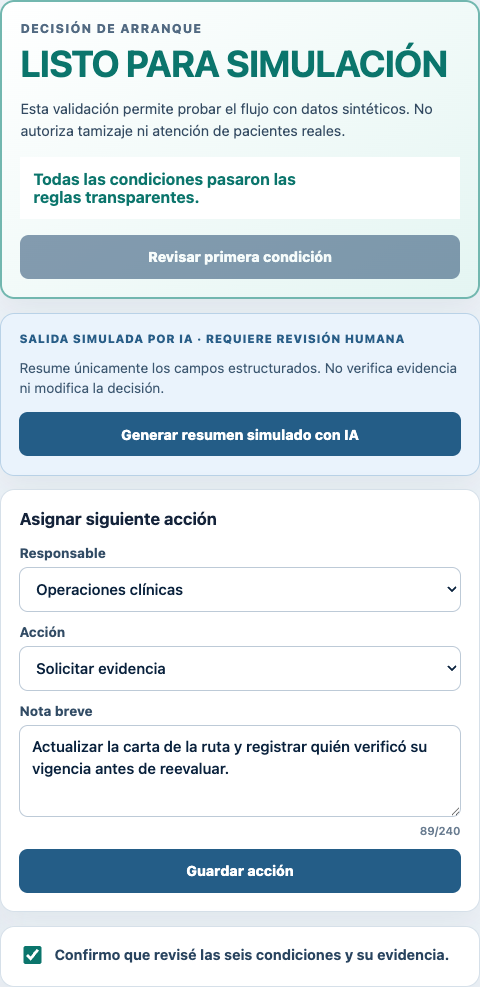
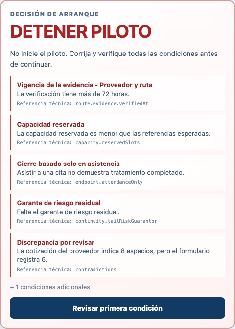
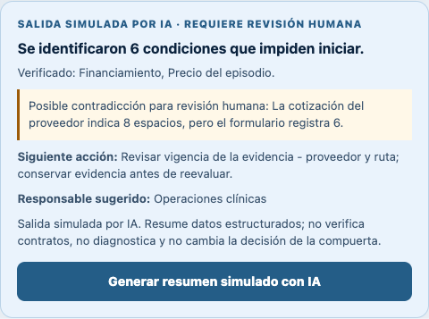
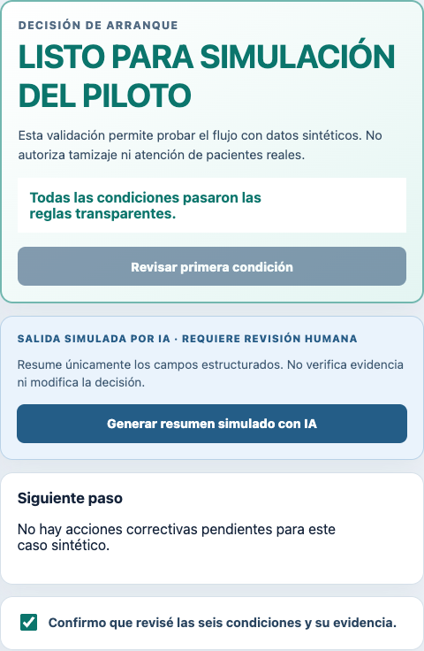

# Persona test — Mariana

## Test record

- **Date:** 10 September 2026
- **Build tested:** Vercel deployment 1, commit `29678cb`
- **URL:** <https://week-5-ruta-segura.vercel.app>
- **Data:** synthetic records only
- **Method:** a fresh browser session was used to complete the task in order. The evaluator stayed in character and did not inspect the implementation while interacting with the interface.

## Persona prompt

> You are Mariana, 41, operations coordinator for a public primary-care network in Mexico City. You are responsible for opening a small screening pilot, but you do not negotiate clinical contracts yourself. You work quickly, distrust vague dashboard labels, and will stop using a tool if it hides who must act next. Walk through each screenshot in order as Mariana. Narrate what you think the screen means, where you hesitate, what evidence you would need, and where you might make a dangerous assumption or quit.

### 1. Incomplete case

**What Mariana thinks:** “The pilot must stop. I can see six mandatory conditions, the 72-hour rule, and which cards are not verified. The synthetic-data label is clear.”

**Hesitation:** The decision list begins with internal names such as `funding.fundingStatus`. Mariana understands the sentence below each name, but not the name itself. The list does not identify who owns each correction.

**Evidence needed:** current commitment from the payer, a fresh route letter, capacity matching expected referrals, a real closure definition, and a named tail-risk guarantor.

### 2. Evidence entry

**What Mariana does:** changes the financing state from “Pendiente” to “Comprometido” and confirms that the financing card becomes verified.

**Hesitation:** the field changes immediately without an explicit save step. The session log helps, but Mariana would still want the source document reviewed by the named verifier; the tool itself does not verify the contract.

### 3. STOP result

**What Mariana thinks:** “Financing is no longer the first blocker, so the gate is responding to my input. The pilot correctly remains stopped.”

**Dangerous assumption:** the first remaining item is a stale route verification, but the screen does not attach a responsible team or exact corrective action to the blocker. Mariana could assume the default “Finanzas” selection below belongs to this issue.

### 4. Simulated-AI summary

**What Mariana thinks:** the output is clearly labeled as simulated and does not change the STOP decision. It correctly notices the structured contradiction.

**Hesitation:** the suggested action repeats `route.evidence.verifiedAt`, an implementation label rather than an operations label. “Operaciones clínicas” is useful, but Mariana still has to translate the field name herself.

### 5. Assigned next action

**What Mariana does:** assigns Operaciones clínicas to request updated evidence and records what must be verified before reevaluation.

**What works:** the saved action appears immediately and the session log records it. The note is bounded and contains no patient data.

### 6. Complete synthetic case

**What Mariana thinks:** all six cards are verified and the human confirmation can produce the simulation-ready state. The warning makes clear that this does not authorize live screening.

**Dangerous failure:** after switching to the complete case, the responsibility, action, and note from the blocked case remain in the form. Mariana could save a stale route-remediation instruction against a different case even though that case has no structural blockers.

## Ranked findings

| Rank | Severity | Finding | Potential harm | Decision |
| --- | --- | --- | --- | --- |
| 1 | High | The next-action draft survives a case change and remains visible in a structurally complete case. | A stale instruction can be assigned to the wrong case, confusing ownership and contaminating the audit trail. | **Fix before final deployment.** |
| 2 | High | STOP reasons do not display a responsible owner or corrective action beside each blocker. | Mariana may assign the wrong team or quit to resolve ownership elsewhere. | Retain for the next usability improvement. |
| 3 | Medium | Decision and AI output expose internal field paths. | The operator must translate developer terminology and may misread the blocker. | Fixed after final review. |
| 4 | Low | The ready headline says “LISTO PARA SIMULACIÓN” rather than the exact longer phrase used in the brief. | The warning prevents a live-care interpretation, but exact rubric language is less visible. | Align copy before submission. |

## Highest-risk fix applied

The application now treats a next-action draft as case-scoped. When the active case changes, it clears the prior owner, action, note, validation error, and saved-action display. When the selected case has no structural blockers, the remediation form is replaced with the correct next step: human confirmation before readiness or a statement that no corrective action is pending afterward. The ready-state heading was also aligned with the brief's exact phrase: **LISTO PARA SIMULACIÓN DEL PILOTO**.

## Follow-up comprehension fix

The decision card now leads with human-readable Spanish condition names such as **Compromiso de financiamiento**, **Vigencia de la evidencia - Proveedor y ruta**, and **Capacidad reservada**. Internal field paths remain available only in a smaller line labeled **Referencia técnica** for auditability. The simulated-AI next action uses the same human-readable terminology instead of asking Mariana to interpret developer field paths.

### Decision card after the comprehension fix

### Simulated-AI guidance after the comprehension fix

### Regression checks

1. Enter an action note in the incomplete case.
2. Save it and switch to `SYN-CDMX-001`.
3. Confirm that the prior note and selection are not visible.
4. Confirm that the complete-but-unconfirmed case asks for human review, not remediation.
5. Confirm the case and verify **LISTO PARA SIMULACIÓN DEL PILOTO** with the non-deployment warning.
6. Confirm that the decision card and simulated-AI guidance lead with human-readable labels while technical paths remain secondary audit references.

All six checks passed in a fresh headless-browser replay against the local production build. All 24 automated tests passed, and the Vite production build completed successfully.

## Before/after evidence

- **Before:** `persona-assets/before-fix/06-complete-case.png` shows the stale action in the complete case.
- **After:** `persona-assets/after-fix/06-complete-case.png` shows that the stale draft is absent and that the case has no pending corrective action.
- **Before labels:** `persona-assets/before-fix/03-stop-result.png` shows internal paths as primary blocker labels.
- **After labels:** `persona-assets/after-fix/03-stop-result.png` shows human-readable blocker names with paths reduced to secondary audit references.

