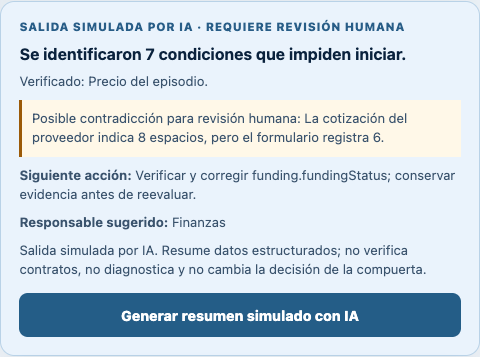
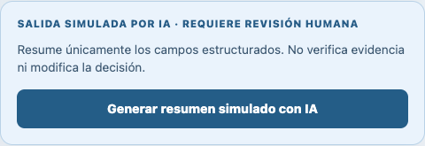
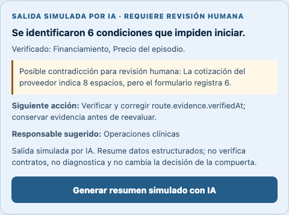
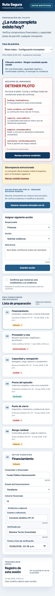

# Mechanical test record

## Test context

- **Date:** 10 September 2026
- **Before-fix build:** Vercel deployment 1 at commit `29678cb`
- **Live URL:** <https://week-5-ruta-segura.vercel.app>
- **Browser:** Google Chrome 152.0.7977.83
- **Runtime:** Node.js 24.19.0
- **Data:** synthetic fixtures only

## Test matrix

| Area | Check | Method | Result |
| --- | --- | --- | --- |
| Gate | Missing payer and uncommitted funding stop the pilot | Automated domain tests | Pass |
| Gate | Evidence at 72 hours passes; older or future evidence stops | Automated domain tests | Pass |
| Gate | Capacity covers referrals and navigator load | Automated domain tests | Pass |
| Gate | Patient contribution remains MXN 0 | Automated domain tests | Pass |
| Gate | Every complete-episode component is required | Automated domain tests | Pass |
| Gate | Attendance alone does not count as treatment closure | Automated domain tests | Pass |
| Gate | Downstream plan and tail-risk guarantor are required | Automated domain tests | Pass |
| Gate | Contradictions, malformed data, and overlong inputs fail closed | Automated domain tests | Pass |
| Gate | A complete case requires human confirmation before simulation readiness | Automated domain tests | Pass |
| Simulated AI | The summary cannot change the deterministic decision | Automated domain tests | Pass |
| Simulated AI | Editing the questionnaire while a summary is pending cannot reveal stale guidance | Browser race test | **Failed before fix; passed after fix** |
| Responsive UI | STOP decision and all six condition cards exist at 390 px | Headless-browser smoke test | Pass |
| Content boundary | No symptom, risk-score, patient-result, credential, token, or secret patterns appear in the rendered source | Source scan | Pass |
| Build | TypeScript and Vite production build | `pnpm --ignore-workspace run build` | Pass |
| Availability | Public deployment responds without authentication | HTTP request | Pass — HTTP 200 |

The automated suite completed with **22 passed, 0 failed**.

## Defect found: stale simulated-AI guidance after an edit

**Severity:** High integrity/usability risk. The deterministic gate stayed in **DETENER PILOTO**, so the defect could not authorize a pilot. However, the advisory panel displayed an obsolete blocker and suggested the wrong next action after the underlying questionnaire had already changed.

### Reproduction on deployment 1

1. Open the incomplete synthetic case.
2. Select **Generar resumen simulado con IA**.
3. Before the 450 ms simulated delay ends, change **Estado del financiamiento** from **Pendiente** to **Comprometido**.
4. Wait for the delayed summary.

### Expected

The pending request is discarded when its source questionnaire changes. A new summary should be generated only after another explicit request and should reflect six current blockers.

### Actual before the fix

The panel reported seven blockers and instructed the operator to correct `funding.fundingStatus`, even though financing was already shown as verified.

### Root cause

The delayed callback closed over the previous gate result. Questionnaire edits cleared the visible AI state, but they did not invalidate the outstanding callback, so it repopulated the panel with obsolete data when its timer completed.

### Fix

Every AI request now receives a monotonically increasing request identifier. Edits to a section or its evidence, case changes, contradiction resolution, and human-confirmation changes invalidate the active identifier. A delayed callback whose identifier is no longer current exits without updating the interface or audit log.

## Regression evidence

After the same rapid click-and-edit sequence, the invalidated request leaves the panel in its neutral state:

A second explicit generation reads the current questionnaire and reports six blockers:

The repeatable browser regression is implemented in `scripts/mechanical-test.cjs`. It fails if the old seven-condition response appears, then verifies that a fresh request returns the current six-condition response.

## Responsive evidence

The after-fix production build also passed a 390 × 844 browser check. The full-page capture preserves the synthetic label, STOP decision, AI limitation, action form, confirmation state, and all six condition cards.

## Deployment status

- Deployment 1 remains preserved in the before-fix screenshots.
- Commit `db1bfc3` was pushed to GitHub and produced Vercel production deployment <https://week-5-ruta-segura-hav83btav-davidbuzali.vercel.app>.
- The stable public alias is <https://week-5-ruta-segura.vercel.app>.
- The complete browser regression, including the rapid edit race and 390 px mobile smoke check, passed against the stable production alias after deployment.
